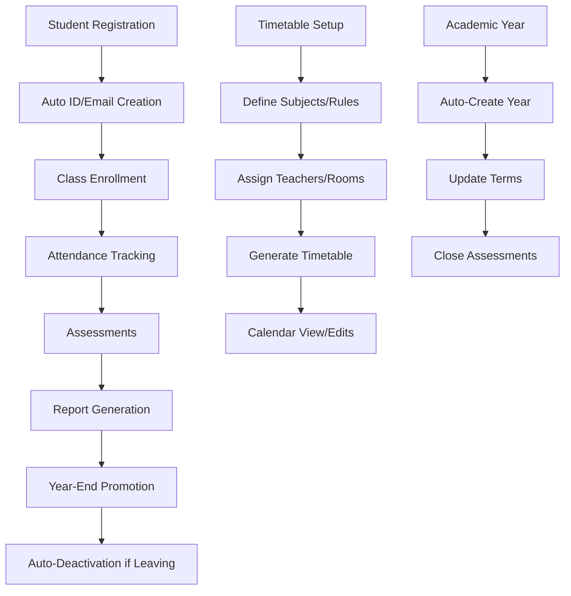

## 📚 Frappe Education Extension

Junior School is a custom [Frappe](https://frappe.io/framework) application that extends the core [Frappe Education](https://frappe.io/education). It provides comprehensive tools for scheduling, attendance tracking, assessment management, and automated student lifecycle processes, specifically designed for multi-school environments.

---

## Table of Contents

- [📚 Frappe Education Extension Customization](#-frappe-education-extension-customization)
- [🚀 Project Overview](#-project-overview)  
- [Key Features](#key-features)
  - [1. 🗓️ School Timetable Page](#1-️-school-timetable-page)
  - [2. ⚙️ Auto-Generation of Timetable](#2-️-auto-generation-of-timetable)
  - [3. 🧑🏽‍🎓 Enhanced Student Attendance](#3--enhanced-student-attendance)
  - [4. 🗂️ Subject Scheduling Tool](#4-️-subject-scheduling-tool)
  - [5. 🧾 Student Report Generation Tool](#5--student-report-generation-tool)
  - [6. 👨🏽‍💻 Student ID-Based Email and User Auto-Creation](#6--student-id-based-email-and-user-auto-creation)
  - [7. 🏫 School as Company](#7--school-as-company)
  - [8. 📊 Assessment Plan Status](#8--assessment-plan-status)
  - [9. 🎓 Academic Year Setup & Automated Student Promotion System](#9--academic-year-setup--automated-student-promotion-system)
  - [10. 🚪 Student Auto-Deactivation](#10--student-auto-deactivation)
  - [11. 📅 Academic Term Update](#11--academic-term-update)
- [🛠️ Installation](#️-installation)
  - [✅ Dependencies](#-dependencies)
  - [☁️ Managed Hosting Frappe Cloud](#️-managed-hosting-frappe-cloud)
  - [🧑🏿‍💻 Self Hosting](#-self-hosting)
- [Key DocTypes](#key-doctypes)
- [Reports](#reports)
- [Dashboards](#dashboards)

---

## 🚀 Project Overview

This extension was built to address the unique needs of junior school management, providing sophisticated tools for educational institutions that require multi-campus support, flexible scheduling, and automated administrative processes. The system maintains compatibility with standard [Frappe Education](https://frappe.io/education) while adding specialized functionality for enhanced school operations.

---
## 🔄 System Workflows

### Core Process Flows


---


## Key Features

### 1. 🗓️ School Timetable Page

A new **School Timetable View** has been implemented using a calendar interface. Type `Timetable` in search bar and click on first suggestion `Open Timetable`.


The key features include:

-   **Calendar Display**: Weekly timetable view (Sun–Sat) showing subjects, teachers, and streams.
    
-   **Filtering Options**:
    
    -   **Levels**: e.g., Pre-primary, Primary
        
    -   **Teachers**: Filter to view specific teacher schedules
        
        
    -   **Streams**: Allows filtering based on class streams
        
-   **Print Functionality**: Filter as required and print the timetable (e.g., per teacher or per stream).
    
-   **Assumption**: The timetable repeats weekly, so only a one-week view is necessary.
    ---

**Interactive Editing**:

-   Users can click any scheduled session to view details in a modal pop-up.
    
-   The modal allows editing and submitting updates, which reflect on the backend immediately.
    


* The user can also click in a space and schedule a class.

---

### 2. ⚙️ Auto-Generation of Timetable

To streamline scheduling, an automated timetable generator has been introduced using a **Single Doctype**: `Timetable Generator`.


#### Structure:

-   **Main Fields**:
    
    -   `Academic Year`
    -   `Academic Term`
    -  `Default Time Slots`
    -  `Lesson Starts`
    -  `Lesson Ends`
        
#### Child Tables:

**a) Subject Rules**  
Defines subject-level constraints:

-   Subject
    
-   Max Time per Session
    
-   Frequency Per Week
    
-   Allow Double Lessons?
    
-   Max Double Lessons Per Week
    

**b) Slot & Breaks Tab**

-   **Time Slots Table**: Define periods (e.g., period 1, 2...) with start/end times and durations.
    
-   **Breaks Table**: Define breaks like breakfast, lunch, etc.. The user must have created this in the `Breaks` doctypes, because it auto-populates the start and end time from the chosen break.
 

   

**c) Teachers Tab**  
Contains a child table `Teacher Preference` with:

-   Teacher Name
    
-   Assigned Subjects and Streams
    
-   Max Periods per Day/Week
    
This helps define teaching limits and areas of specialization.

**d) Teaching Rooms**  
In the `Teaching Rooms` child table:

-   Assign specific rooms to each subject-stream combination.
    
-   Junior school rooms default to classes, with extras like labs or libraries.
    

#### Generation Flow:

1.  User fills in all the above data and `save`.
    
2.  Clicks `Generate Timetable`.
    
3.  The process is queued for backend scheduling due to time complexity.
    
4.  The system manages duplicate and failed schedules with internal retry/rescheduling mechanisms.
    

**🛠️ Status**:

-   Work in progress.
    
-   Some logic misbehaviors.
    
-   Double lessons are yet to be fully implemented.
  ---

### 3. 🧑🏽‍🎓 Enhanced Student Attendance

To support **multi-shift attendance** (e.g., morning & evening), the following has been introduced:

-   New Doctype: `Enhanced Student Attendance Tool`
    
    -   Based on `Student Attendance Tool` with additional fields:
        
        -   `Shift` (Linked to HR shift types)
            
        -   `Start Time`, `End Time`
          


            
-   `Student Attendance` Doctype Changes:
    
    -   New field: `Shift`
        
    -   Override on the default duplicate attendance validation logic:
        
        -   Allows multiple attendance entries per day based on shift.
            
        -   Ensures no overlapping shifts.
     

---

### 4. 🗂️ Subject Scheduling Tool

Creating course schedules with consistent time across days was limiting. To address this:

-   Created a new Doctype: `Subject Scheduling Tool`
    
    -   Replicates the `Course Scheduling Tool` with improvements.
        
    -   **Child Table**: `Subject Time`
        
        -   Allows scheduling different times for different days.
            
        -   Example:
            
            -   Monday: 8:00–9:00 AM
                
            -   Wednesday: 10:00–11:00 AM
                
        -   Checkbox `Reschedule` for when you are rescheduling an already scheduled subject.
            

This tool improves flexibility and real-world scheduling accuracy.


---

### 5. 🧾 Student Report Generation Tool

A new feature has been added to the `Student Report Generation Tool` to support customizable report card printing.

-   **Field Added**: `Custom Print Report Card` (Checkbox)
    
    -   When checked, the system prints a report card using a **custom template**, designed to align with the institution's branding and reporting preferences.
        
    -   This template reflects the **layout and styling** shown in the sample below:
        
    
   
        
-   **Group Filter Removed**:  
    To enhance flexibility during events like half-term breaks, the **group filter** was removed. This enables users to:
    
    -   Generate report cards for **any assessment group**.
        
    -   Allow students to take their report cards home during half-term or early departures without restriction.
 
    ---

### 6. 👨🏽‍💻 Student ID-Based Email and User Auto-Creation

#### 🛠️ Key Features:

-   **Custom Student ID Format**:
    
    -   Student ID is **auto-generated** based on the selected **School**.
        
    -   The ID format follows a **prefix** derived from the school abbreviation, followed by a numeric sequence.
        
    -   Example: For a school with abbreviation `JNS`, the Student ID might be `JNS-0001`.
        
    -   ⚠️ _This logic is customizable depending on the use case or naming convention required._
    


        
-   **Auto-Generated Student Email**:
    
    -   Since younger students may not have emails, the system synthesizes one using the format:
        
        `<student_id>@gmail.com` 
        
        Example: `JNS0001@gmail.com`
        
-   **Username = Cleaned Student ID**:
    
    -   The **username** is set to the `Student ID` with all non-alphanumeric characters removed (e.g., no slashes or symbols).
        
        `safe_username = re.sub(r"\W+", "", self.custom_student_id)` 
        
-   **Password = Student ID**:
    
    -   The **password** for the student account is set as their `Student ID` (including special characters, if any).
        
-   **Login Behavior**:
    
    -   Students **log in using their username**, which is their cleaned-up Student ID.
        
    -   They use their Student ID (original) as the **password**.
        
    -   This approach is enabled by adjusting **System Settings** to allow username-based login.

#### Backend Override

The default Frappe logic for user creation has been overridden via a custom controller, `ModifiedStudent`, where the user account is generated upon saving a new `Student` document.
---

### 7. 🏫 School as Company

To support **multi-school** or **multi-campus** setups within one ERPNext instance, we introduced a structural change: **each School is now treated as a Company**. This lets users leverage native ERPNext features like permissions, chart of accounts, assets, and HR, scoped to a school.

#### ✅ Key Benefits

-   Enables **multi-school management** under a single ERPNext instance.
    
-   Uses ERPNext's built-in `Company` logic to segment data per school.
    
-   Allows clear scoping for:
    
    -   Financials
        
    -   Student data
        
    -   Assessments
        
    -   Attendance
        
    -   Reporting
        
    -   Instructor and program tracking
        
-   Filters are applied across key doctypes (e.g., **Course Schedule**) to restrict selection to records relevant to the selected school:


-   You can only select **streams**, **student groups**, or **instructors** that belong to the specified school.
        
-   Ensures clean data separation and avoids cross-school data mixing.

Once this is implemented:

-   You can apply **User Permissions** for `Company` to restrict access to specific school data.
    
-   Customize **dashboards**, **reports**, and **queries** by filtering on `company`.

  ---

### 8. 📊 Assessment Plan Status


To improve filtering and tracking of assessments, we introduced a **`status`** field to the **Assessment Plan** doctype.

#### ✅ Key Purpose

-   Distinguish between **active** (open) and **completed** (closed) assessment plans.
    
-   Make it easier to **filter only "Open" plans** in tools like the **Assessment Result Tool**.


    
-   Enable **automation** to close assessment plans once the academic term ends.

#### ⚙️ Scheduler for Auto-Closure

We added a **scheduler job** that:

-   Monitors assessment plans.
    
-   Checks the **term end date** linked to each plan.
    
-   Automatically updates `status` from **Open → Closed** once the term ends.
    

This ensures accurate status without requiring manual updates.
---

### 9. 🎓 Academic Year Setup & Automated Student Promotion System

#### 📌 Overview

This system is designed to automatically:

-   **Create a new Academic Year** at the beginning of each calendar year.
    
-   **Promote students** to their next grade or stream using rules defined per school.

  ---

#### 🕐 Scheduled Jobs

**1. Academic Year Creation**

-   **Trigger Time:** Every year on **January 1st at 12:00 AM**.
    
-   **Function:** `create_academic_year()`
    
-   **Description:** Automatically creates a new `Academic Year` document with:
    
    -   `year_start_date = YYYY-01-01`
        
    -   `year_end_date = YYYY-12-31`
        
    -   `academic_year_name = "YYYY Academic Year"`
      ---
        

**2. Auto Enrollment into New Year**

-   **Trigger Time:** Immediately after academic year creation.
    
-   **Function:** `update_enrolment_tool()`
    
-   **Description:** Uses the Automated Program Enrollment Tool to:
    
    -   Load student enrollments from the **previous academic year**.
        
    -   Apply **promotion rules** (per class and stream).
        
    -   Enroll promoted students into the **new academic year and term**.

#### Promotion Rules Engine

Each school can configure **promotion rules** via the `Automated Program Enrollment Tool`:


#### Fields Explained:

-   **Get Students From:** Source of existing enrollments (e.g., _Class Enrollment_).
    
-   **Academic Year / Term:** Current (source) academic year and term.
    
-   **Enrollment Date:** Date to apply the new enrollment (typically start of next year).

#### 🔄 Promotion Rules:

| Field           | Description         |
|----------------|---------------------|
| Current Class  | e.g., Grade 4       |
| Current Stream | e.g., Grade 4 Blue  |
| New Class      | e.g., Grade 5       |
| New Stream     | e.g., Grade 5 Blue  |

Each row defines how students will move from their current level to the next.

#### Enrollment Details:

-   **New Academic Year:** Target year for promotion (e.g., _2026 Academic Year_).
    
-   **New Academic Term:** Typically _Term 1_ of the new year.
    
-   **Enroll Students Button:** Executes the promotion based on defined rules.

#### ✅ Result

By running the above process:

-   Each school seamlessly transitions into the new year.
    
-   All eligible students are promoted and re-enrolled automatically.
    
-   No manual intervention is required at the start of each year.


### 10. 🚪 Student Auto-Deactivation

When a student's **Date of Leaving** is entered, the system automatically updates their status and removes related records to keep the database clean and consistent.

#### Actions Taken:

* **Custom Status** is set to **"Left"**
* The student record is **disabled** (`enabled = 0`)
* The student is **removed from their assigned stream** (`Student Group Student`)
* Any active **Class Enrollment** linked to the student is **cancelled**


This ensures that the student no longer appears in active lists or reports after their departure.

#### Similarity to Employee Deactivation

This logic mirrors the behavior for employees:
* When an **End Date** is entered for an employee, they are automatically marked as inactive.
* The system adjusts the **active employee count** and deactivates any related links.

This approach helps maintain data integrity and simplifies status tracking across both **students** and **employees**.

### 11. 📅 Academic Term Update

Update ensures that all **Student Groups(Streams)** reflect the correct **Academic Term** based on the current date.

#### Weekly scheduler which:
* Checks today's date and determines the academic year (e.g., `2025 Academic Year`).
* Finds the academic term that includes today's date.
* Updates each **Student Group** in the academic year to use the correct academic term.


**Helps:** Keeping the **Academic Term** field up-to-date ensures accurate reporting, filtering, and planning based on term-specific data.

---

# REPORTS
### 1. Average Performance per Stream


This report calculates and visualizes the **average academic performance** per student group (stream) based on assessment results.

### 🔍 Features

- **Filters**:
  - School (Company) ✅ *(Required)*
  - Academic Year ✅ *(Required)*
  - Academic Term *(Optional)* – allows filtering by a specific term or viewing data for the entire year.

- **Metrics Displayed**:
  - Stream (Student Group)
  - Average Percentage Score (%), calculated as:
    ```text
    (total_score / maximum_score) * 100
    ```
### 📊 Chart

- A **bar chart** summarizing average performance across streams.
- Enables quick visual comparison of student performance by stream within a selected academic year or term.
- Streams are sorted from **highest to lowest** average performance for better insights

### 2. Analysis Report


This report provides a breakdown of learners' grade distribution across different subjects within a selected school, academic year, and optionally a student group.

### 🔍 Features

- **Filters**:
  - School (Company) ✅ *(Required)*
  - Academic Year ✅ *(Required)*
  - Student Group *(Optional)*

- **Metrics Displayed**:
  - Grade (e.g., A, B, C, etc.)
  - Number of learners per grade **per subject**
  - Total number of learners per grade

- **Dynamic Columns**:
  - Each subject becomes a column.
  - Subject names are retrieved dynamically based on available data.

### 📘 How It Works

For each **grade**, the report:
- Counts the number of assessment records (learners) achieving that grade in each subject.
- Displays a total count of learners who received that grade across all subjects.

This helps analyze how grades are distributed subject-wise and overall, making it easier to identify performance trends or challenges by subject or grade.

### 3. Annual Performance Comparison


This report compares the **average academic performance** of student groups (streams) between two academic years, helping educators and administrators track progress or decline over time.

### 🔍 Features

- **Filters**:
  - School (Company) ✅ *(Required)*
  - Current Year ✅ *(Required)*
  - Compare Year ✅ *(Required)*
  - Academic Term *(Optional)* – to narrow down the comparison within a specific term.

- **Metrics Displayed**:
  - Stream (Student Group)
  - Average Score for each year
  - **Deviation** – the difference between the current year and comparison year scores.

### 🎨 Visual Enhancements

- **Color-coded Deviation**:
  - Green for positive deviation (performance improvement)
  - Red for negative deviation (performance decline)

- **School Mean Row**:
  - A summary row showing the overall average score for the school in both years and their deviation.

### 🧠 Use Case
Use this report to:
- Identify which streams have improved or declined in academic performance.
- Support data-driven decision-making for curriculum or teaching adjustments.
- Quickly visualize progress using intuitive formatting and mean calculations.
- 

### 4. Departmental Analysis Report


The **Departmental Analysis Report** provides a detailed breakdown of average scores across all courses for each stream (student group), with corresponding overall means and grade rubrics. It helps departments understand performance variations across subjects and student groups in a given academic period.

### 🔍 Features

- **Filters**:
  - School (Company) ✅ *(Required)*
  - Academic Year ✅ *(Required)*
  - Academic Term ✅ *(Required)*
  - Grading Scale ✅ *(Required)* – used to convert numeric means into letter/rubric grades.

- **Metrics Displayed**:
  - Stream (Student Group)
  - Course-wise Average Scores per Stream
  - Mean Score per Stream
  - Grade (Rubric) per Stream – based on selected grading scale

- **Summary Rows** (automatically added):
  - **TOTAL**: Sum of average scores per course across all streams
  - **MEAN**: Mean of average scores per course across all streams
  - **MAX**/**MIN**: Highest and lowest average score per course across streams
  - **Rubric**: Letter grade for each course average using grading scale

### 🧠 Use Case

This report enables:
- Department heads and academic leads to identify high-performing or struggling subjects.
- Comparative analysis of performance across streams and departments.
- Insights into grading trends using rubric conversion based on average scores.

### 5. Assessment Group Analysis


The **Assessment Group Analysis Report** provides a comparative overview of key performance metrics across all subjects for a selected academic period. This report is useful for analyzing how a specific student group or stream is performing in each course.

### 🔍 Features

- **Filters**:
  - School (Company) ✅ *(Required)*
  - Academic Year ✅ *(Required)*
  - Academic Term *(Optional)* – allows narrowing results to a specific term.
  - Student Group *(Optional)* – filter performance data by stream.

- **Metrics Displayed**:
  The report generates rows based on core metrics, and columns dynamically based on subjects (courses) within the filtered scope:
  - **Total Score** – Total marks accumulated by students in a subject.
  - **Mean Score** – Average score per subject.
  - **Grade** – The assigned grade code (if applicable).
  - **Max Score** – Highest score achieved in each subject.
  - **Min Score** – Lowest score recorded for each subject.

- **Dynamic Column Generation**:
  - Columns are created dynamically based on all unique courses available in the filtered dataset, making the report flexible across different institutions or terms.

### 🧠 Use Case

Use this report to:
- Monitor subject-level performance within a specific stream or academic setting.
- Compare performance across subjects using different metrics (mean, max, min, grade).
- Quickly identify strengths and weaknesses in subject delivery or student understanding.

### 6.  Most Improved Students 

The **Most Improved Students Report** is designed to help academic institutions highlight students who have demonstrated the greatest improvement across two academic terms. By comparing average assessment scores between a “comparison term” and the “current term,” this report identifies and displays the top improver in each student group.


### 🔍 Features

- **Filters**:
  - **School (Company)** ✅ *(Required)* – the institution to scope the data to.
  - **Academic Year** ✅ *(Required)* – defines the academic period in focus.
  - **Current Term** ✅ *(Required)* – the term whose performance will be analyzed.
  - **Comparison Term** ✅ *(Required)* – the prior term to compare against.
  - **Student Group** *(Optional)* – narrow results to a specific stream or class.

- **Metrics Displayed**:
  - **Average (Current Term)** – mean score for each student in the selected current term.
  - **Average (Comparison Term)** – mean score for the same student in the comparison term.
  - **Deviation** – difference between the current and previous term averages.
  - **Student Name** – the name of the top improved student per stream.
  - **Student Group** – the class or stream they belong to.

- **Highlighting**:
  - Color-coded deviation values:
    - 🟢 *Green* for improvement (positive deviation)
    - 🔴 *Red* for decline (negative deviation)


### 🧠 Use Case

Use this report to:
- Identify students who have made significant academic gains.
- Recognize and reward improvement efforts across academic terms.
- Track academic progress at a group or stream level.
- Gain insight into the effectiveness of interventions or teaching strategies.
- 
### 7. Academic Performance Summary Report


The **Academic Performance Summary Report** provides schools with a comprehensive overview of student academic performance across a selected academic term. It aggregates total and average scores, assigns letter grades based on a defined grading scale, and includes a visual breakdown of grade distribution for quick insights.

---

### 🔍 Features

- **Filters**:
  - **School (Company)** ✅ *(Required)* – the institution whose data is being analyzed.
  - **Academic Year** ✅ *(Required)* – the academic year in context.
  - **Academic Term** ✅ *(Required)* – the term to evaluate.
  - **Student Group** *(Optional)* – filter data by stream or class.
  - **Grading Scale** ✅ *(Required)* – define how numerical scores are translated to letter grades.

- **Metrics Displayed**:
  - **Total Score** – total marks accumulated by each student.
  - **Average Score** – the mean score across assessments.
  - **Grade** – letter grade assigned based on configured grading thresholds.
  - **Student Group** – class or stream affiliation.
  - **Student Name** – the learner whose performance is being reviewed.

- **Highlighting & Visualization**:
  - **Grade Highlighting** – letter grades appear in bold for visual emphasis.
  - **Grade Distribution Pie Chart** – dynamically generated pie chart showing the spread of grades.

---

### 🧠 Use Case

Use this report to:
- Monitor overall academic performance of students within a specific term or stream.
- Identify top-performing students or those needing additional support.
- Visualize grade distribution across the entire student population.
- Track consistency of grading across multiple subjects or streams.
---


# DashBoards
## 1. Students Overview


The **Student Overview Dashboard** provides a high-level summary of key student enrollment metrics, offering quick insights into school population, gender distribution, and class trends over time.

### 🔍 Features

- **Number Cards**:
  - **Total Members per School**: Displays the total number of registered students for each school, helping track overall enrollment.
  - **Gender Distribution**: Visualizes the count of male and female students, enabling quick assessment of gender balance.

- **Trend Chart**:
  - **Class Enrollment Trend (Line Graph)**: Shows how enrollment numbers have changed over time, allowing users to spot growth patterns or declines in class-level student registration.


---

## 🛠️ Installation

### ✅ Dependencies

* [Frappe Framework](https://frappe.io/framework)
* [ERPNext](https://frappe.io/erpnext)  
* [ERPNext Education Module](https://frappe.io/education)
* [Frappe HR](https://frappe.io/hr) 

### ☁️ Managed Hosting [Frappe Cloud](https://frappecloud.com/)

1. Login to your Frappe Cloud account
2. Navigate to Sites/Bench Groups dashboard
3. Go to **Apps** tab and select **+ Install APP** / **+ Add APP**
4. Select **Add from Github** and add repository URL
5. Install Application or Fetch Branches

### 🧑🏿‍💻 Self Hosting

1. Ensure you have a working Frappe and ERPNext instance with Education module
2. Clone this repository into your Frappe bench apps directory:

```bash
bench get-app https://github.com/navariltd/Junior-School.git
```

3. Install the app into your site:

```bash
bench --site [your-site-name] install-app nl_school
```

4. Reload and restart the bench:

```bash
bench restart
```

---

## Key DocTypes

### Timetable Generator
Central configuration doctype for automated timetable generation with subject rules, time slots, teacher preferences, and room assignments.

### Enhanced Student Attendance Tool  
Extended attendance tool supporting multi-shift tracking with shift-specific time ranges and validation.

### Subject Scheduling Tool
Flexible scheduling tool enabling different time allocations per day for improved real-world scheduling accuracy.

### Automated Program Enrollment Tool
Comprehensive student promotion management with configurable rules for academic year transitions.

---


